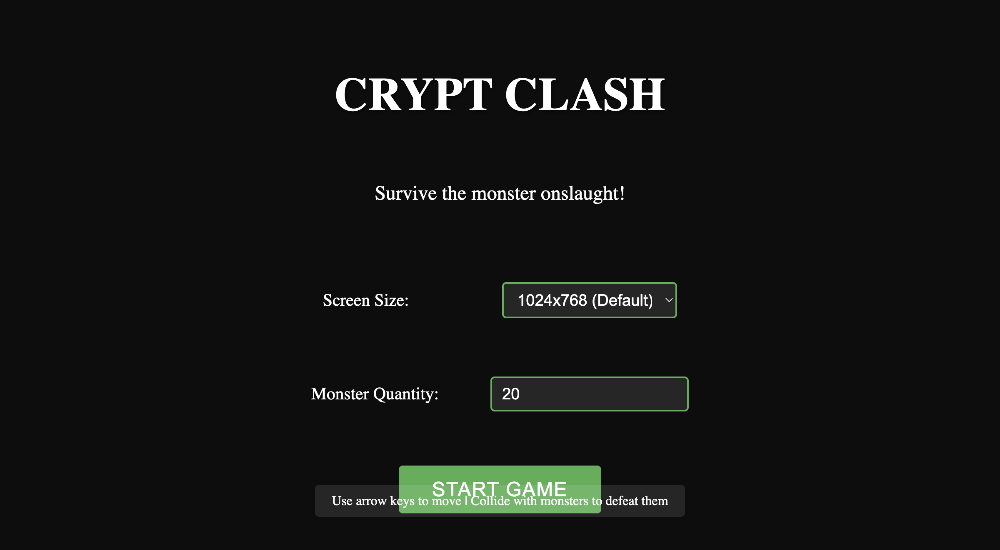

# Crypt Clash

## Background Story
In the shadowed crypts of Arkanoth, an ancient evil stirs. You are Kaelthar, a battle-worn adventurer drawn to the ruins by rumors of the Void Shard - a cursed artifact said to grant dominion over life and death. But the crypt's spectral guardians have awakened, twisted by centuries of dark magic into relentless hunters.

Survive the ever-shifting catacombs as waves of corrupted beings emerge from the gloom:
- **Brutes**: Hulking remnants of temple guardians, their stone flesh animated by malice
- **Stalkers**: Swift shadows that once were acolytes, now bound to eternal vigilance
- **Phantom Wraiths**: The tortured souls of failed seekers, phase-shifting through ancient walls

The deeper you delve, the more the crypt reforms itself, its layout warping to protect the Shard. Every crystal collected temporarily stalls the corruption spreading through your veins... but at what cost?

## Development Notes
**This project was developed entirely using AI assistance** 🤖  
- Primary IDE: [Cursor](https://cursor.sh/)  
- AI Model: [Deepseek-R1](https://deepseek.com/)  
- Development Style: Conversational AI pair programming

## Features
- 🕹️ WASD/Arrow key movement
- 🧱 Random map generation with safe spawn zone
- 👾 3 unique enemy types with different behaviors
- 🛑 Collision detection with terrain and enemies
- 👀 Enemy AI with line-of-sight mechanics

## Controls
- **Movement**:  
  ← → / A D - Move horizontally  
  ↑ ↓ / W S - Move vertically  
- **Combat**:  
  Space - Sword attack (direction follows movement)  
- **Abilities**:  
  Collect crystals for temporary buffs (automatic activation)

> Note: Movement is fluid with diagonal support. Attack direction matches your last movement vector.

## Installation
1. Clone repo:
```bash
git clone https://github.com/wanglen/thegame.git
cd thegame
```
2. Make run script executable:
```bash
chmod +x run.sh
```
3. Start the game:
```bash
./run.sh
```

## Changelog
See [CHANGELOG.md](CHANGELOG.md) for version history

Built with vanilla JavaScript and HTML5 Canvas



[](https://deepseek.com)
[](LICENSE)

## Installation Prerequisites
- Modern web browser (Chrome 90+, Firefox 88+)
- Python 3.6+ (for local server)
- Git (optional)

## Contributing
While this is a solo project, suggestions are welcome! Please open an issue to discuss any changes.

## Accessibility
- Full keyboard controls
- High contrast visual elements
- Configurable UI scaling (planned)
- Contact via issues for specific needs